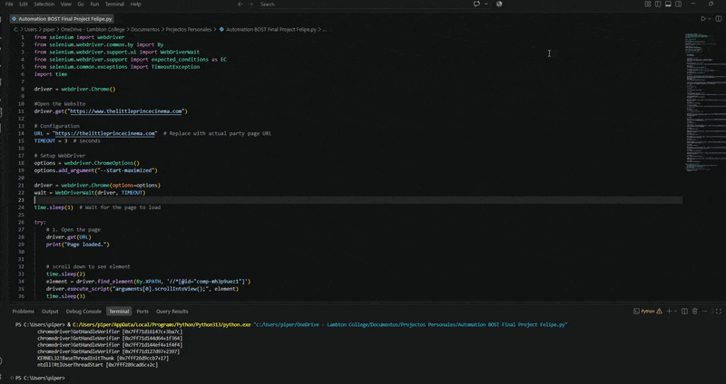

                                       PRESS PLAY TO SEE THE DEMO

This demo is about a little cinema located in the Greater Toronto Area; it's called The Little Prince Cinema, and it is the smallest cinema in the world, in one of my college classes
Our teacher (who is a friend of the owner) asked us to help him check for any UI or interface issues that we can see during our walkthrough on the webpage, we automated the walkthrough and 
checked different functionalities; this is the result.

You can check the full code and the different test cases I made.

! Keep in mind that there is no sensitive info shown in this code or in the videos!

# FOLDER DESCRIPTION!
In this folder, you are going to create different projects and TEST cases for businesses in real life. There are a couple of examples here that explore the automation
and testing of different companies and their websites. 
